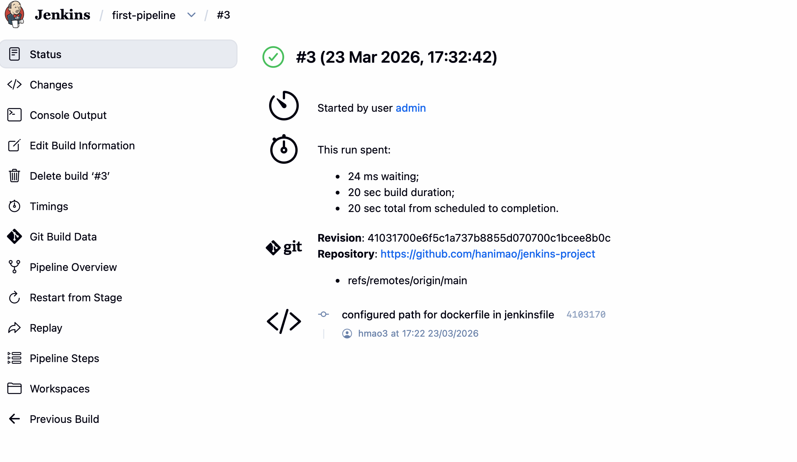

# Project Overview

This repository deploys a jenkins server on AWS using an EC2 instance launch template. Jenkins is a self-contained, open source automation server. The goal was to automate the entire software delivery process from code integration to deployment ensuring fast, reliable, and scalable application delivery.

---

# Key Features 

This project demonstrates a **jenkin server** deployed on AWS using **Terraform**.  
 
1. **ALB**
   - Sits in the public subnet and listens for traffic on Port 80 (HTTP) and Port 443 (HTTPS). The ALB pings /login path to see if the instance is healthy. 
2. **Route53**
   - Serves as the domain name system (DNS) for the application. It routes traffic from your sub domain (**jenkins.hanimao.com**) to the load balance DNS name. 
3. **EC2 and Launch Template**
   - Defines the attributes of your server: the AMI, instance type, and the User Data script that installs Jenkins.
4. **User Data Script**
   - Automates the installation of Java and Jenkins when the instance starts 
5. **Security Groups & VPC**
   - Acts as a firewall that controlls the traffic allowed to reach one or more EC2 instances. Ensure Port 8080 (Jenkins) and Port 22 (SSH) is open
6. **Jenkins**
   - CI/CD pipeline automation

---

# Architecture  

---

# Workflow

### Pre-requisites 

- An AWS account
- An Amazon EC2 key pair
- Java (JDK) Installed
---

### Install Jenkins and Java

Use a user data script to automate the installation. Go to the userdata.sh folder.

### **Here's what it will look like**

Connect to http://<your_server_public_DNS> from your browser. You will be able to access Jenkins through its management interface:

- SSH into the EC2 instance and enter the password found in sudo cat **/var/lib/jenkins/secrets/initialAdminPassword**
- Then Click on Install suggested Pluggins
- Create First Admin User
- Once the set up is done, the jenkins Dashboard will appear.

### Install Docker Pipeline and ECR Plugin in Jenkins

- Log in to Jenkins.
- Go to Manage Jenkins > Manage Plugins.
- In the Available tab, search for "Docker Pipeline".
- Select the plugin and click the Install button.
- Restart Jenkins after the plugin is installed.

### Docker Slave Configuration

Run the below command to Install Docker for an Amazon Linux 2023 Instance

`sudo yum install git -y`
 
 `sudo dnf update -y`

 `sudo dnf install docker -y`
 
 `sudo systemctl start docker`
 
 `start systemctl enable docker`
 
 ### Grant Jenkins user permission to docker deamon 

`sudo usermod -aG docker jenkins`

`sudo su -s /bin/bash jenkins`

`systemctl restart docker`

The docker agent config is now successful. 

### Jenkins Pipeline

To build Jenkins pipeline to create Docker image and push the image to AWS Elastic Container Registry (ECR).

- Create the Image Repository on ECR and Project Repository on GitHub with Webhook
- Create Jenkins Pipeline for the Project with GitHub Webhook
- Clean up the Image Repository on AWS ECR

